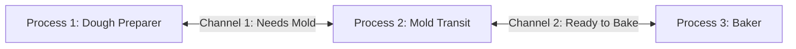

# Go Concurrency Made Simple

Welcome! This guide explains Go's concurrency in simple English with easy real-world examples. We will go through this step-by-step together.

---

## 1. What is Concurrency?

**Concurrency** is about **structuring** your program. It means breaking a big task into smaller, independent tasks that can be managed at the same time.

### 🍳 Real-World Example: Cooking a Meal
Imagine you are making breakfast:
1. You put bread in the toaster.
2. While the bread is toasting, you fry an egg.
3. While the egg is frying, you brew some coffee.

You are only **one person** (one CPU core), but you are managing multiple tasks at the same time. This is **concurrency**.

---

## 2. Concurrency vs. Parallelism

People often confuse these two, but they are different:
*   **Concurrency:** Dealing with many things at once (organizing/structuring tasks).
*   **Parallelism:** Doing many things at the same time (executing tasks simultaneously on multiple CPU cores).


### 👥 The Chef Example
*   **Concurrency (1 Chef):** You switch between toasting bread, frying an egg, and brewing coffee. You manage multiple tasks, but only work on one at any single micro-moment.
*   **Parallelism (2 Chefs):** Chef A fries the egg while Chef B brews the coffee at the exact same second.

---

## 3. Communicating Sequential Processes (CSP)

**CSP** is the concurrency model (the philosophy) that Go uses. It was invented in 1978.

To understand CSP, let's look at the difference between the **Old Way** of concurrency and the **Go Way**:

### 🚫 The Old Way (Shared Memory)
*   Imagine two people trying to write notes on the **same page of a notebook at the exact same time**. 
*   They will write over each other's words, causing a complete mess.
*   In programming, this is called **Shared Memory**. To prevent mess, programmers have to use complicated locks (Mutexes) to make sure only one person writes at a time. This is hard to write and prone to bugs.

### 🧬 The Go Way (CSP Model)
*   Instead of writing in the same notebook, the two people sit in separate rooms. When they want to share information, they write it on a piece of paper and send it to the other person through a **tube (Channel)**.
*   This is the core rule of Go concurrency:
    > *"Do not communicate by sharing memory; instead, share memory by communicating."*


#### 🔍 Understanding the Diagram & The Quote:
1.  **"Do not communicate by sharing memory"**: 
    *   Look at the **CSP diagram**: 
        *   You will see **three horizontal bars (lanes)** representing **Process 1, Process 2, and Process 3**.
        *   They are completely separate timelines. They do not share a single box of memory.
2.  **"instead, share memory by communicating"**:
    *   Look at how they exchange data:
        *   The **teal (greenish-blue) parts** of the bars show when a process is running (**Execution**).
        *   The **pink/red parts** show when a process is waiting (**Blocked**).
        *   There are lines/arrows connecting the processes (e.g., from Process 1 to Process 2). These represent sending (**Send**) and receiving (**Receive**) data through a **Channel**.
        *   By communicating through these channels, the processes safely share data (memory) without conflicting.

---

### 🔍 How to Read the CSP Diagram

To understand the CSP diagram, think of it as a **timeline graph** that you read from left to right.

#### 1. The Axes (How to look at the layout):
*   **Horizontal axis (Left to Right):** This is **Time**. As you move your eyes from left to right, time is moving forward.
*   **Vertical axis (Top to Bottom):** These are **three separate processes** running at the same time:
    *   **Top Lane:** Process 1
    *   **Middle Lane:** Process 2
    *   **Bottom Lane:** Process 3

#### 2. The Color Blocks (What is happening):
*   **Teal (Greenish-Blue) blocks:** The process is **Executing** (running code active).
*   **Pink / Red blocks:** The process is **Blocked** (paused and waiting). In Go, when a process (goroutine) tries to send or receive data through a channel, it will pause (block) until the other side is ready.

#### 3. Write, Read, and Channels (How they communicate):
*   **Write (Send):** A process tries to send data into a channel.
*   **Read (Receive):** A process tries to get data from a channel.
*   **Channel (The vertical line connecting lanes):** This is a **Synchronization Point** (a meeting spot). It is not just about moving data; it is where two processes must wait for each other to align.
*   **Dashed vertical lines (Synchronized):** The exact moment two processes meet at the channel to swap data and unblock each other.

---

### 🍳 Step-by-Step Flow: The Cake Factory Example

To match the diagram perfectly, let's use a **Cake Factory** with three workers:

*   **Process 1 (Dough Preparer):** Prepares the cake dough.
*   **Process 2 (Mold Preparer & Transit):** Prepares the cake mold and moves the cakes.
*   **Process 3 (Baker):** Bakes the cakes in the oven.



Let's read the diagram step-by-step from **Left to Right**:

#### Step 1: Process 1 gets Blocked on Read (Far Left)
*   **Process 1 (Top)** starts working, but quickly reaches a point where it needs a mold from Process 2 to proceed (**Read**).
*   Since Process 2 is not ready with a mold yet, **Process 1 turns Pink (Blocked)**. It must stand still and wait.
*   Meanwhile, **Process 2 (Middle)** and **Process 3 (Bottom)** are running actively (**Teal**).

#### Step 2: The First Synchronization (First vertical channel line)
*   As time moves right, **Process 2** finishes preparing the mold and writes it to the channel (**Write**).
*   Because **Process 1** was already waiting (**Pink/Blocked**), they instantly meet at the channel.
*   They synchronize (**dashed vertical line**). Process 1 receives the mold, turns **Teal (Executing)**, and both processes continue working.

#### Step 3: Process 2 gets Blocked on Write (Middle-Right)
*   **Process 2 (Middle)** finishes putting the cake in the mold and wants to send it to the oven (**Write**).
*   However, **Process 3 (Baker - Bottom)** is still busy working on something else (it is **Teal** and has not called **Read** yet).
*   Because the Baker is not ready to receive, **Process 2 turns Pink (Blocked)** on its Write operation. It is stuck holding the cake, waiting for the Baker.

#### Step 4: The Second Synchronization (Second vertical channel line)
*   Finally, **Process 3 (Baker)** finishes its task and reads from the channel (**Read**).
*   The moment the Baker reads, the connection is made. 
*   They synchronize (**dashed vertical line**). **Process 2** is released, turns back to **Teal (Executing)**, and all processes finish their work.

---

### 💻 Go Code Example: The Cake Factory Pipeline

Here is a working Go program that simulates the exact timeline and blocking behavior described in the diagram above:

```go
package main

import (
	"fmt"
	"time"
)

// Process 1: Dough Preparer (Top Lane)
func doughPreparer(ch chan string) {
	fmt.Println("[Process 1] Started preparing dough...")
	time.Sleep(1 * time.Second) // Working for 1 second

	fmt.Println("[Process 1] Needs mold -> BLOCKED (Waiting to Read from channel)")
	mold := <-ch // Pauses here until Process 2 sends the mold

	fmt.Println("[Process 1] Received:", mold, "-> UNBLOCKED")
	fmt.Println("[Process 1] Continuing to prepare cake...")
}

// Process 2: Mold Preparer & Transit (Middle Lane)
func moldTransit(ch1 chan string, ch2 chan string) {
	fmt.Println("[Process 2] Started preparing mold...")
	time.Sleep(3 * time.Second) // Working for 3 seconds

	fmt.Println("[Process 2] Sending mold to Process 1 (Writing to channel 1)")
	ch1 <- "Cake Mold" // Sync Point 1: Unblocks Process 1

	fmt.Println("[Process 2] Mold sent. Now putting cake into the mold...")
	time.Sleep(2 * time.Second) // Working for 2 seconds

	fmt.Println("[Process 2] Sending cake to Process 3 (Writing to channel 2) -> BLOCKED")
	ch2 <- "Unbaked Cake" // Pauses here because Process 3 is not ready to read yet

	fmt.Println("[Process 2] Process 3 received cake. Process 2 is released -> UNBLOCKED")
}

// Process 3: Baker (Bottom Lane)
func baker(ch chan string) {
	fmt.Println("[Process 3] Busy preparing the oven...")
	time.Sleep(8 * time.Second) // Working for 8 seconds (busy)

	fmt.Println("[Process 3] Ready to bake next cake (Reading from channel 2)")
	cake := <-ch // Sync Point 2: Unblocks Process 2

	fmt.Println("[Process 3] Received:", cake, "-> Starting to bake!")
}

func main() {
	// Channels act as the synchronization points
	ch1 := make(chan string)
	ch2 := make(chan string)

	// Start the processes concurrently
	go doughPreparer(ch1)
	go moldTransit(ch1, ch2)
	go baker(ch2)

	// Wait to let all processes finish
	time.Sleep(10 * time.Second)
}
```

#### Expected Output:
When you run the code, you will see the exact synchronization and blocking log in the console:

```text
[Process 3] Busy preparing the oven...
[Process 2] Started preparing mold...
[Process 1] Started preparing dough...
[Process 1] Needs mold -> BLOCKED (Waiting to Read from channel)
[Process 2] Sending mold to Process 1 (Writing to channel 1)
[Process 2] Mold sent. Now putting cake into the mold...
[Process 1] Received: Cake Mold -> UNBLOCKED
[Process 1] Continuing to prepare cake...
[Process 2] Sending cake to Process 3 (Writing to channel 2) -> BLOCKED
[Process 3] Ready to bake next cake (Reading from channel 2)
[Process 3] Received: Unbaked Cake -> Starting to bake!
[Process 2] Process 3 received cake. Process 2 is released -> UNBLOCKED
```

---


*   Whoever arrives first must stop and turn **Pink (Blocked)** until the second person arrives to complete the handshake (**Synchronized**).

---

## 4. Basic Concurrency Concepts (Common Problems)

When writing concurrent code, programs run multiple tasks at the same time. This can cause bugs that are hard to find. Here are the most common problems you should know:

### 🏎️ Data Race

A **Data Race** happens when two or more tasks access the same variable/memory at the exact same time, and **at least one of them is writing** (changing) the data.

#### 🍳 Real-world Example: Shared Sticky Note
Imagine two people trying to write a number on the same sticky note at the exact same time. One wants to write `10` and the other wants to write `20`. The result might end up being a garbled mess like `12` or `0`, because their pen strokes overlap.

#### 💻 Go Code Example:
```go
package main

import (
	"fmt"
	"time"
)

func main() {
	var count = 0

	// Task 1: Writing to count
	go func() {
		count = 10
	}()

	// Task 2: Writing to count at the same time
	go func() {
		count = 20
	}()

	time.Sleep(100 * time.Millisecond)
	fmt.Println("Count is:", count) // We don't know if it will be 10, 20, or a bug!
}
```

---

### 🏁 Race Condition

A **Race Condition** is a broader design flaw where the correctness of your program depends on **who finishes first** (the timing or order of events).

#### 🍳 Real-world Example: Buying the Last Ticket
Two people are trying to buy the last seat on a flight at the exact same moment. 
1. Person A checks: "Is seat free?" -> Yes.
2. Person B checks: "Is seat free?" -> Yes.
3. Person A clicks "Buy".
4. Person B clicks "Buy".
The system might sell the single seat to both, or crash, depending on whose request is processed first by the server.

---

### 🛑 Deadlock

A **Deadlock** happens when two or more tasks are waiting for each other, and because nobody moves, the entire program is **stuck forever**.

#### 🍳 Real-world Example: Narrow Bridge
Two cars meet head-to-head on a one-lane bridge. Neither driver is willing to back up. Both cars sit there forever.

#### 🔒 The 4 Coffman Conditions (Why Deadlocks Happen)
For a deadlock to occur, **all four** of these conditions must be true at the same time. Let's explain them using the **Narrow Bridge** example (with **Car 1** and **Car 2** meeting in the middle of a one-lane bridge):

1.  **Mutual Exclusion (Only One User):** 
    *   *What it means:* A resource can only be held by one process at a time.
    *   *Bridge Analogy:* The bridge is so narrow that **only one car can occupy a single spot** on it. Car 1 and Car 2 cannot merge into the exact same physical space.
    

2.  **Hold and Wait (Keeping what you have while waiting):** 
    *   *What it means:* A process holds onto its current resource while waiting to get another resource.
    *   *Bridge Analogy:* 
        *   **Car 1** drives onto the left side of the bridge. It holds its spot (**Hold**) and waits for the right side to clear (**Wait**).
        *   **Car 2** drives onto the right side of the bridge. It holds its spot (**Hold**) and waits for the left side to clear (**Wait**).
        *   Neither car is willing to back off the bridge to let the other pass.
    

3.  **No Preemption (No Stealing):** 
    *   *What it means:* A resource cannot be taken away from a process by force; it must be released voluntarily.
    *   *Bridge Analogy:* Driver 1 **cannot force** Driver 2 to back up or tow their car away. The car will only move if Driver 2 decides to put it in reverse voluntarily.
    

4.  **Circular Wait (Waiting in a Loop):** 
    *   *What it means:* Process A is waiting for B, which is waiting for A (forming a circle).
    *   *Bridge Analogy:* 
        *   **Car 1** cannot go forward because **Car 2** is blocking the lane. (Car 1 is waiting for Car 2).
        *   **Car 2** cannot go forward because **Car 1** is blocking the lane. (Car 2 is waiting for Car 1).
        *   Both cars are waiting for each other in a closed loop, so nobody moves.
    

---

### 🚶 Livelock

A **Livelock** is similar to a deadlock, but the tasks are not frozen. They are **actively changing their states**, but they are still not making any real progress.

#### 🍳 Real-world Example: Polite Hallway Walk
You are walking down a hallway and meet someone walking the opposite way. 
*   You step to the left to let them pass, and they step to their right (which is your left) at the same time.
*   You both realize you are blocking each other, so you both step to the other side at the same time.
*   You keep moving side-to-side, but you are stuck in the same spot.

---

### 😋 Starvation

**Starvation** happens when a task is ready to run, but the system keeps ignoring it and giving all the resources to other tasks. The task is "starved" of CPU time.

#### 🍳 Real-world Example: Busy Buffet
You are waiting in line at a buffet to get food, but greedy people keep cutting in front of you. Because the line never ends and people keep cutting, you never get any food and go hungry.

