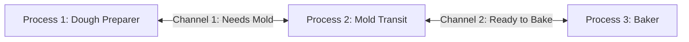

# Go Concurrency Made Simple

Welcome! This guide explains Go's concurrency in simple English with easy real-world examples. We will go through this step-by-step together.

---

## 1. What is Concurrency?

**Concurrency** is about **structuring** your program. It means breaking a big task into smaller, independent tasks that can be managed at the same time.

### 🍳 Real-World Example: Cooking a Meal
Imagine you are making breakfast:
1. You put bread in the toaster.
2. While the bread is toasting, you fry an egg.
3. While the egg is frying, you brew some coffee.

You are only **one person** (one CPU core), but you are managing multiple tasks at the same time. This is **concurrency**.

---

## 2. Concurrency vs. Parallelism

People often confuse these two, but they are different:
*   **Concurrency:** Dealing with many things at once (organizing/structuring tasks).
*   **Parallelism:** Doing many things at the same time (executing tasks simultaneously on multiple CPU cores).


### 👥 The Chef Example
*   **Concurrency (1 Chef):** You switch between toasting bread, frying an egg, and brewing coffee. You manage multiple tasks, but only work on one at any single micro-moment.
*   **Parallelism (2 Chefs):** Chef A fries the egg while Chef B brews the coffee at the exact same second.

---

## 3. Communicating Sequential Processes (CSP)

**CSP** is the concurrency model (the philosophy) that Go uses. It was invented in 1978.

To understand CSP, let's look at the difference between the **Old Way** of concurrency and the **Go Way**:

### 🚫 The Old Way (Shared Memory)
*   Imagine two people trying to write notes on the **same page of a notebook at the exact same time**. 
*   They will write over each other's words, causing a complete mess.
*   In programming, this is called **Shared Memory**. To prevent mess, programmers have to use complicated locks (Mutexes) to make sure only one person writes at a time. This is hard to write and prone to bugs.

### 🧬 The Go Way (CSP Model)
*   Instead of writing in the same notebook, the two people sit in separate rooms. When they want to share information, they write it on a piece of paper and send it to the other person through a **tube (Channel)**.
*   This is the core rule of Go concurrency:
    > *"Do not communicate by sharing memory; instead, share memory by communicating."*


#### 🔍 Understanding the Diagram & The Quote:
1.  **"Do not communicate by sharing memory"**: 
    *   Look at the **CSP diagram**: 
        *   You will see **three horizontal bars (lanes)** representing **Process 1, Process 2, and Process 3**.
        *   They are completely separate timelines. They do not share a single box of memory.
2.  **"instead, share memory by communicating"**:
    *   Look at how they exchange data:
        *   The **teal (greenish-blue) parts** of the bars show when a process is running (**Execution**).
        *   The **pink/red parts** show when a process is waiting (**Blocked**).
        *   There are lines/arrows connecting the processes (e.g., from Process 1 to Process 2). These represent sending (**Send**) and receiving (**Receive**) data through a **Channel**.
        *   By communicating through these channels, the processes safely share data (memory) without conflicting.

---

### 🔍 How to Read the CSP Diagram

To understand the CSP diagram, think of it as a **timeline graph** that you read from left to right.

#### 1. The Axes (How to look at the layout):
*   **Horizontal axis (Left to Right):** This is **Time**. As you move your eyes from left to right, time is moving forward.
*   **Vertical axis (Top to Bottom):** These are **three separate processes** running at the same time:
    *   **Top Lane:** Process 1
    *   **Middle Lane:** Process 2
    *   **Bottom Lane:** Process 3

#### 2. The Color Blocks (What is happening):
*   **Teal (Greenish-Blue) blocks:** The process is **Executing** (running code active).
*   **Pink / Red blocks:** The process is **Blocked** (paused and waiting). In Go, when a process (goroutine) tries to send or receive data through a channel, it will pause (block) until the other side is ready.

#### 3. Write, Read, and Channels (How they communicate):
*   **Write (Send):** A process tries to send data into a channel.
*   **Read (Receive):** A process tries to get data from a channel.
*   **Channel (The vertical line connecting lanes):** This is a **Synchronization Point** (a meeting spot). It is not just about moving data; it is where two processes must wait for each other to align.
*   **Dashed vertical lines (Synchronized):** The exact moment two processes meet at the channel to swap data and unblock each other.

---

### 🍳 Step-by-Step Flow: The Cake Factory Example

To match the diagram perfectly, let's use a **Cake Factory** with three workers:

*   **Process 1 (Dough Preparer):** Prepares the cake dough.
*   **Process 2 (Mold Preparer & Transit):** Prepares the cake mold and moves the cakes.
*   **Process 3 (Baker):** Bakes the cakes in the oven.



Let's read the diagram step-by-step from **Left to Right**:

#### Step 1: Process 1 gets Blocked on Read (Far Left)
*   **Process 1 (Top)** starts working, but quickly reaches a point where it needs a mold from Process 2 to proceed (**Read**).
*   Since Process 2 is not ready with a mold yet, **Process 1 turns Pink (Blocked)**. It must stand still and wait.
*   Meanwhile, **Process 2 (Middle)** and **Process 3 (Bottom)** are running actively (**Teal**).

#### Step 2: The First Synchronization (First vertical channel line)
*   As time moves right, **Process 2** finishes preparing the mold and writes it to the channel (**Write**).
*   Because **Process 1** was already waiting (**Pink/Blocked**), they instantly meet at the channel.
*   They synchronize (**dashed vertical line**). Process 1 receives the mold, turns **Teal (Executing)**, and both processes continue working.

#### Step 3: Process 2 gets Blocked on Write (Middle-Right)
*   **Process 2 (Middle)** finishes putting the cake in the mold and wants to send it to the oven (**Write**).
*   However, **Process 3 (Baker - Bottom)** is still busy working on something else (it is **Teal** and has not called **Read** yet).
*   Because the Baker is not ready to receive, **Process 2 turns Pink (Blocked)** on its Write operation. It is stuck holding the cake, waiting for the Baker.

#### Step 4: The Second Synchronization (Second vertical channel line)
*   Finally, **Process 3 (Baker)** finishes its task and reads from the channel (**Read**).
*   The moment the Baker reads, the connection is made. 
*   They synchronize (**dashed vertical line**). **Process 2** is released, turns back to **Teal (Executing)**, and all processes finish their work.

---

### 💻 Go Code Example: The Cake Factory Pipeline

Here is a working Go program that simulates the exact timeline and blocking behavior described in the diagram above:

```go
package main

import (
	"fmt"
	"time"
)

// Process 1: Dough Preparer (Top Lane)
func doughPreparer(ch chan string) {
	fmt.Println("[Process 1] Started preparing dough...")
	time.Sleep(1 * time.Second) // Working for 1 second

	fmt.Println("[Process 1] Needs mold -> BLOCKED (Waiting to Read from channel)")
	mold := <-ch // Pauses here until Process 2 sends the mold

	fmt.Println("[Process 1] Received:", mold, "-> UNBLOCKED")
	fmt.Println("[Process 1] Continuing to prepare cake...")
}

// Process 2: Mold Preparer & Transit (Middle Lane)
func moldTransit(ch1 chan string, ch2 chan string) {
	fmt.Println("[Process 2] Started preparing mold...")
	time.Sleep(3 * time.Second) // Working for 3 seconds

	fmt.Println("[Process 2] Sending mold to Process 1 (Writing to channel 1)")
	ch1 <- "Cake Mold" // Sync Point 1: Unblocks Process 1

	fmt.Println("[Process 2] Mold sent. Now putting cake into the mold...")
	time.Sleep(2 * time.Second) // Working for 2 seconds

	fmt.Println("[Process 2] Sending cake to Process 3 (Writing to channel 2) -> BLOCKED")
	ch2 <- "Unbaked Cake" // Pauses here because Process 3 is not ready to read yet

	fmt.Println("[Process 2] Process 3 received cake. Process 2 is released -> UNBLOCKED")
}

// Process 3: Baker (Bottom Lane)
func baker(ch chan string) {
	fmt.Println("[Process 3] Busy preparing the oven...")
	time.Sleep(8 * time.Second) // Working for 8 seconds (busy)

	fmt.Println("[Process 3] Ready to bake next cake (Reading from channel 2)")
	cake := <-ch // Sync Point 2: Unblocks Process 2

	fmt.Println("[Process 3] Received:", cake, "-> Starting to bake!")
}

func main() {
	// Channels act as the synchronization points
	ch1 := make(chan string)
	ch2 := make(chan string)

	// Start the processes concurrently
	go doughPreparer(ch1)
	go moldTransit(ch1, ch2)
	go baker(ch2)

	// Wait to let all processes finish
	time.Sleep(10 * time.Second)
}
```

#### Expected Output:
When you run the code, you will see the exact synchronization and blocking log in the console:

```text
[Process 3] Busy preparing the oven...
[Process 2] Started preparing mold...
[Process 1] Started preparing dough...
[Process 1] Needs mold -> BLOCKED (Waiting to Read from channel)
[Process 2] Sending mold to Process 1 (Writing to channel 1)
[Process 2] Mold sent. Now putting cake into the mold...
[Process 1] Received: Cake Mold -> UNBLOCKED
[Process 1] Continuing to prepare cake...
[Process 2] Sending cake to Process 3 (Writing to channel 2) -> BLOCKED
[Process 3] Ready to bake next cake (Reading from channel 2)
[Process 3] Received: Unbaked Cake -> Starting to bake!
[Process 2] Process 3 received cake. Process 2 is released -> UNBLOCKED
```

---


*   Whoever arrives first must stop and turn **Pink (Blocked)** until the second person arrives to complete the handshake (**Synchronized**).

---

## 4. Basic Concurrency Concepts (Common Problems)

When writing concurrent code, programs run multiple tasks at the same time. This can cause bugs that are hard to find. Here are the most common problems you should know:

### 🏎️ Data Race

A **Data Race** happens when two or more tasks access the same variable/memory at the exact same time, and **at least one of them is writing** (changing) the data.

#### 🍳 Real-world Example: Shared Sticky Note
Imagine two people trying to write a number on the same sticky note at the exact same time. One wants to write `10` and the other wants to write `20`. The result might end up being a garbled mess like `12` or `0`, because their pen strokes overlap.

#### 💻 Go Code Example:
```go
package main

import (
	"fmt"
	"time"
)

func main() {
	var count = 0

	// Task 1: Writing to count
	go func() {
		count = 10
	}()

	// Task 2: Writing to count at the same time
	go func() {
		count = 20
	}()

	time.Sleep(100 * time.Millisecond)
	fmt.Println("Count is:", count) // We don't know if it will be 10, 20, or a bug!
}
```

---

### 🏁 Race Condition

A **Race Condition** is a broader design flaw where the correctness of your program depends on **who finishes first** (the timing or order of events).

#### 🍳 Real-world Example: Buying the Last Ticket
Two people are trying to buy the last seat on a flight at the exact same moment. 
1. Person A checks: "Is seat free?" -> Yes.
2. Person B checks: "Is seat free?" -> Yes.
3. Person A clicks "Buy".
4. Person B clicks "Buy".
The system might sell the single seat to both, or crash, depending on whose request is processed first by the server.

---

### 🛑 Deadlock

A **Deadlock** happens when two or more tasks are waiting for each other, and because nobody moves, the entire program is **stuck forever**.

#### 🍳 Real-world Example: Two Kids Drawing
Two kids (Alice and Bob) want to draw. To draw, a kid needs **both** a **sheet of paper** and a **crayon**. There is only **one sheet of paper** and **one crayon** on the table. Alice grabs the crayon, and Bob grabs the paper. Neither wants to share or let go. Both kids sit there forever, unable to draw.

#### 🔒 The 4 Coffman Conditions (Why Deadlocks Happen)
For a deadlock to occur, **all four** of these conditions must be true at the same time. Let's explain them using the **Two Kids Drawing** example:

1.  **Mutual Exclusion (Only One User):** 
    *   *What it means:* A resource can only be held by one process at a time.
    *   *Drawing Analogy:* The paper and crayon are exclusive resources. Only one kid can hold the crayon at a time, and only one kid can write on the paper at a time. They cannot share them simultaneously.

2.  **Hold and Wait (Keeping what you have while waiting):** 
    *   *What it means:* A process holds onto its current resource while waiting to get another resource.
    *   *Drawing Analogy:* 
        *   **Alice** holds the crayon (**Hold**) and waits for the paper (**Wait**).
        *   **Bob** holds the paper (**Hold**) and waits for the crayon (**Wait**).
        *   Neither kid is willing to release what they are holding until they get the other item.

3.  **No Preemption (No Stealing):** 
    *   *What it means:* A resource cannot be taken away from a process by force; it must be released voluntarily.
    *   *Drawing Analogy:* Alice **cannot force** Bob to hand over the paper, and Bob **cannot force** Alice to hand over the crayon. They can only get the other resource if the other kid decides to put it down voluntarily.

4.  **Circular Wait (Waiting in a Loop):** 
    *   *What it means:* Process A is waiting for B, which is waiting for A (forming a circle).
    *   *Drawing Analogy:* 
        *   **Alice** is waiting for **Bob** to give her the paper.
        *   **Bob** is waiting for **Alice** to give him the crayon.
        *   They are waiting for each other in a closed loop (Alice -> Bob -> Alice), so nobody moves.

---

### 🚶 Livelock

A **Livelock** is similar to a deadlock, but the tasks are not frozen. They are **actively changing their states**, but they are still not making any real progress.

#### 🍳 Real-world Example: Polite Hallway Walk
You are walking down a hallway and meet someone walking the opposite way. 
*   You step to the left to let them pass, and they step to their right (which is your left) at the same time.
*   You both realize you are blocking each other, so you both step to the other side at the same time.
*   You keep moving side-to-side, but you are stuck in the same spot.

---

### 😋 Starvation

**Starvation** happens when a task is ready to run, but the system keeps ignoring it and giving all the resources to other tasks. The task is "starved" of CPU time.

#### 🍳 Real-world Example: Busy Buffet
You are waiting in line at a buffet to get food, but greedy people keep cutting in front of you. Because the line never ends and people keep cutting, you never get any food and go hungry.

---

## 5. Goroutines

In this lesson, we will learn about Goroutines.

> *"Don't communicate by sharing memory, share memory by communicating."* — Rob Pike

#### 💡 What does this mean?
*   **Old way (Sharing Memory):** Imagine two coworkers trying to write notes on the **same page of a single notebook** at the exact same time. To avoid writing over each other, they must lock and unlock the notebook. If they make a mistake, their notes get ruined (Data Race) or they freeze waiting for the lock (Deadlock).
*   **Go way (Communicating):** The two coworkers sit in **separate rooms**, each having their own notebook. When one coworker wants to share data, they write it on a slip of paper, put it in a **pneumatic tube (Channel)**, and send it to the other room. The receiver reads the paper and writes it down in their own notebook. No locks are needed!

### What is a Goroutine?
A **goroutine** is a lightweight thread of execution that is managed by the Go runtime and essentially lets us write asynchronous code in a synchronous manner.

#### 💡 What does "asynchronous code in a synchronous manner" mean?
Normally, when we write asynchronous code (like fetching data from a database or calling an API) in other languages, we have to use complicated structures like **callbacks**, **Promises**, or **async/await** to handle waiting.

In Go, **you just write code normally, from top to bottom (synchronous style)**. Behind the scenes, the Go runtime does all the magic: if your code has to wait for something (like waiting for a channel or network), Go pauses the Goroutine, works on other things, and wakes it up when it's ready. You get the speed of asynchronous code, but the simplicity of normal synchronous code!

Let's look at how this compares:

*   **Python (Asynchronous syntax):**
    ```python
    # We must explicitly mark functions as async and use the "await" keyword
    async def main():
        result = await fetch_data()
        print(result)
    ```
*   **Go (Synchronous syntax, but runs asynchronously under the hood):**
    ```go
    // This looks like simple, step-by-step code, but Go runs it asynchronously!
    result := fetchData() // If this blocks, Go automatically pauses this goroutine and runs others
    fmt.Println(result)
    ```

It is important to know that **they are not actual OS threads**, and the **main function itself runs as a goroutine**.

### 🍳 Real-world Example: The Restaurant Kitchen
Imagine you are running a busy restaurant:

| Concept / Component | Restaurant Analogy | Go Runtime Reality |
| :--- | :--- | :--- |
| **Active Worker** | **Chef** (Expensive to hire, needs physical kitchen space, tools) | **OS Thread** (Expensive to create, requires ~1MB+ memory stack, limited by CPU cores) |
| **Unit of Work** | **Order Slip** (Cheap piece of paper, ~2KB-equivalent space, contains instructions and current state) | **Goroutine** (Lightweight thread, starts at only ~2KB stack size, contains call stack and program counter) |
| **Scale / Limit** | **100,000 orders** can easily sit on the counter, but you cannot fit 100,000 chefs in the kitchen. | **100,000+ goroutines** can run concurrently, but you cannot spawn 100,000 OS threads without crashing. |
| **Scheduler** | **Kitchen Manager** (Assigns order slips to available chefs) | **Go Runtime Scheduler** (Maps thousands of goroutines onto a few active OS threads) |
| **I/O Blocking** | **Waiting for water to boil** (Chef doesn't stand idle; they put the order slip on hold and start chopping veggies for another order) | **Waiting for network/disk/channel** (Go runtime pauses the goroutine, frees the OS thread to execute other goroutines) |
| **Context Switch** | **Picking up a different order slip** (Extremely fast, just read the next piece of paper) | **Switching Goroutines** (Very fast, ~10-100ns, done entirely in user space without OS intervention) |


### 🚀 How they work: Cooperative & Asynchronous Scheduling
A single thread may run thousands of goroutines in them by using the **Go runtime scheduler**.

This implies that if the current goroutine is blocked or has been completed, the scheduler will automatically ensure other waiting goroutines keep running without being blocked.

Here is how the Go Scheduler handles blocking depending on the type of operation:

#### Scenario A: Blocking on User-space events (e.g., Channels, Network I/O, Mutexes)
The OS Thread does **not** block. The Go scheduler simply pauses the active Goroutine and swaps it out for another one.

```text
[Normal State]
┌────────────────┐     ┌──────────────┐
│ OS Thread (M)  │ ◄── │ Go Scheduler │ ◄── [ Run Queue: G2, G3 ]
└───────┬────────┘     └──────────────┘
        │ (Executing)
        ▼
     ┌──────┐
     │  G1  │ (Active)
     └──────┘

[G1 Blocks on Channel/Network -> Scheduler swaps in G2]
┌────────────────┐     ┌──────────────┐
│ OS Thread (M)  │ ◄── │ Go Scheduler │ ◄── [ Run Queue: G3 ]
└───────┬────────┘     └───────┬──────┘
        │ (Swaps in)           │ (Puts on hold / Netpoller)
        ▼                      ▼
     ┌──────┐               ┌──────┐
     │  G2  │ (Active)      │  G1  │ (Waiting / Suspended)
     └──────┘               └──────┘
```

#### Scenario B: Blocking on Kernel-space events (e.g., File I/O, System Calls)
The OS Thread (M1) gets blocked by the Operating System. The Go Scheduler detaches the remaining queue and moves them to a new/free OS Thread (M2) so they can keep running.

```text
[G1 starts a heavy File Read -> Thread M1 is blocked by the OS kernel]
┌────────────────┐
│ OS Thread (M1) │ ◄── G1 (Reading File)
└───────┬────────┘
        │ (BLOCKED by Kernel)
        ▼
     (Stuck)

[Scheduler detaches the queue and moves it to a fresh Thread M2]
┌────────────────┐     ┌──────────────┐
│ OS Thread (M2) │ ◄── │ Go Scheduler │ ◄── [ Run Queue: G2, G3 ]
└───────┬────────┘     └──────────────┘
        │ (Continues executing remaining tasks)
        ▼
     ┌──────┐
     │  G2  │ (Active)
     └──────┘
```


### 🔱 The Fork-Join Model
Before we write any code, it is important to briefly discuss the **Fork-Join Model**.

Go's concurrency follows this model, which consists of two phases:
1.  **Fork:** At some point, the main flow of execution splits (forks) to run a task concurrently in the background. In Go, we do this using the `go` keyword.
2.  **Join:** At a later point, these concurrent tasks join back with the main flow of execution. Without a join point, the main program might finish and exit before the background task even has a chance to start!


### 💻 How to use a Goroutine
We can turn any function into a goroutine by simply using the `go` keyword:

```go
go fn(x, y, z)
```

Here is a simple Go program demonstrating the Fork-Join model using a basic `time.Sleep` as our temporary join point:

```go
package main

import (
	"fmt"
	"time"
)

// This function runs synchronously inside its own goroutine.
// We write it line-by-line, but Go can pause/resume it asynchronously!
func printMessage(message string) {
	for i := 1; i <= 3; i++ {
		fmt.Println(message, i)
		// When time.Sleep is called, Go does not block the entire CPU thread.
		// Instead, it pauses (blocks) this specific goroutine and lets other goroutines run.
		time.Sleep(100 * time.Millisecond) 
	}
}

func main() {
	// 1. FORK: Start printMessage as a new Goroutine in the background.
	// This starts asynchronously, but the code inside printMessage is written synchronously!
	go printMessage("Running in background...")

	// Run printMessage in the main Goroutine.
	// Because of the 'go' keyword above, the main thread doesn't wait;
	// it immediately starts executing this line concurrently.
	printMessage("Running in main thread...")

	// 2. JOIN: Wait for the background Goroutine to finish before main exits.
	// (If we remove this Sleep, the program exits immediately without printing the background task!)
	time.Sleep(500 * time.Millisecond)
	fmt.Println("Done!")
}
```

Output:
```
Running in main thread... 1
Running in background... 1
Running in main thread... 2
Running in background... 2
Running in background... 3
Running in main thread... 3
Done!
```

#### 🔍 What happens in the code:
*   `go printMessage("Running in background...")` forks the execution. Go runs this function concurrently and immediately moves to the next line of `main`.
*   The main thread continues executing `printMessage("Running in main thread...")`.
*   We use `time.Sleep(500 * time.Millisecond)` as a simple **Join** point to keep the main goroutine alive so the background goroutine can finish its work.

---

## 6. Channels

In this section, we will explore **Channels**—the pipes that connect concurrent Goroutines. They allow Goroutines to send and receive values to and from each other, serving as both a communication medium and a synchronization tool.


---

### 🚇 What is a Channel?
A **channel** is a typed conduit through which you can send and receive values with the channel operator, `<-`. 

#### 💡 The Pneumatic Tube Analogy
Imagine two offices connected by a **pneumatic tube**:
*   To send a message, you put it in a capsule and push it into the tube (`ch <- value`).
*   To receive a message, you wait at the other end and pull the capsule out (`value := <-ch`).
*   The tube ensures the message travels safely from one office (Goroutine) to the other without anyone else grabbing it.

---

### 🛠️ Declaring and Initializing Channels
Like maps and slices, channels must be created using the built-in `make` function before they can be used:

```go
// Declaring a channel that can only transport integers
var ch chan int

// Initializing the channel
ch = make(chan int)

// Or in a single line:
ch := make(chan int)
```

> [!WARNING]
> Sending to or receiving from a `nil` channel (a channel that has been declared but not initialized with `make`) will **block forever**, leading to a deadlock.

---

### 🚦 Unbuffered vs. 📦 Buffered Channels

Go provides two types of channels: **Unbuffered** and **Buffered**. They differ in how they block and synchronize.

| Feature | Unbuffered Channel (`make(chan T)`) | Buffered Channel (`make(chan T, capacity)`) |
| :--- | :--- | :--- |
| **Capacity** | `0` (or not specified) | `> 0` (e.g., `make(chan int, 3)`) |
| **Blocking Behavior** | **Sends** block until a receiver is ready.<br>**Receives** block until a sender is ready. | **Sends** only block when the buffer is **full**.<br>**Receives** only block when the buffer is **empty**. |
| **Synchronization** | **Guaranteed sync**: Both goroutines handshake at the exact same moment. | **Decoupled**: Sender can continue working until the buffer fills up. |
| **Real-world Analogy** | **Relay Baton**: The runner cannot let go of the baton until the next runner grabs it. | **Mailbox**: You can drop off mail even if the recipient is asleep, until the mailbox is full. |

#### 1. Unbuffered Channels (Relay Baton)
An unbuffered channel requires both the sender and receiver to be ready at the same time. If one side is not ready, the other side blocks and waits.

##### 💻 Go Code Example:
```go
package main

import (
	"fmt"
	"time"
)

func worker(ch chan string) {
	fmt.Println("[Worker] Working on task...")
	time.Sleep(2 * time.Second)
	
	fmt.Println("[Worker] Sending result to channel... (Will block if main is not ready)")
	ch <- "Task Completed!" // Blocks here until main reads from ch
	fmt.Println("[Worker] Result sent! Worker released.")
}

func main() {
	ch := make(chan string) // Unbuffered channel

	go worker(ch)

	time.Sleep(1 * time.Second) // Main sleeps for 1 second
	fmt.Println("[Main] Ready to receive result... (Reading from channel)")
	
	result := <-ch // Main receives from ch. This unblocks the worker!
	fmt.Println("[Main] Received:", result)
}
```

##### 🔍 How the code runs step-by-step:
1. `go worker(ch)` starts running. It sleeps for 2 seconds.
2. In the meantime, `main` sleeps for 1 second, then reaches `result := <-ch`. Because the worker is still sleeping and hasn't sent anything, `main` **blocks (turns Pink)**.
3. At second 2, `worker` wakes up and calls `ch <- "Task Completed!"`.
4. The handshake occurs immediately: `main` receives the data and unblocks, and `worker` is also released to print `"Worker released."`.

---

#### 2. Buffered Channels (Mailbox)
A buffered channel has a queue of a fixed size. Sends are non-blocking as long as there is room in the buffer. Receives are non-blocking as long as there is at least one item in the buffer.

##### 💻 Go Code Example:
```go
package main

import "fmt"

func main() {
	// Create a buffered channel with a capacity of 2
	ch := make(chan string, 2)

	// These sends are non-blocking because the buffer is not full yet
	ch <- "Message 1"
	ch <- "Message 2"
	fmt.Println("Sent 2 messages to buffer without blocking!")

	// The third send would block because the capacity is 2 and buffer is full!
	// ch <- "Message 3" // Uncommenting this without a receiver in a goroutine causes deadlock!

	// Receives are non-blocking because there is data in the buffer
	fmt.Println("Received:", <-ch)
	fmt.Println("Received:", <-ch)
}
```

---

### 🔌 Closing Channels & 🔄 Ranging over Channels

When a sender is finished sending data, it can **close** the channel to signal to the receiver that no more values will be sent.

#### 💡 The Rule of Closing
*   **Only the sender should close a channel**, never the receiver. Sending to a closed channel will cause a **panic**.
*   Closing a channel is **not required** unless you need to signal to the receiver that no more data is coming (e.g., to terminate a loop).

#### 🔄 Using `range` to read until Closed
You can use a `for range` loop to read values from a channel until it is closed. The loop automatically exits when the channel is closed and all remaining buffered data is read.

##### 💻 Go Code Example:
```go
package main

import (
	"fmt"
	"time"
)

func producer(ch chan int) {
	for i := 1; i <= 3; i++ {
		ch <- i
		time.Sleep(500 * time.Millisecond)
	}
	fmt.Println("[Producer] All items sent. Closing channel...")
	close(ch) // Close the channel to tell the receiver to stop waiting
}

func main() {
	ch := make(chan int)

	go producer(ch)

	// The range loop automatically reads from the channel
	// and exits when the channel is closed.
	fmt.Println("[Receiver] Waiting for items...")
	for num := range ch {
		fmt.Printf("[Receiver] Got: %d\n", num)
	}
	fmt.Println("[Receiver] Channel closed! Done.")
}
```

#### 🛡️ Checking if a Channel is Closed (`ok` idiom)
You can also detect whether a channel has been closed by assigning a second boolean variable to the receive operation:

```go
val, ok := <-ch
```
*   `ok` is `true`: The value was successfully received from the channel.
*   `ok` is `false`: The channel has been closed and there are no more values left to receive. Any further reads will return the **zero value** of the channel's type immediately without blocking.

---

### 🏹 Channel Direction (Directional Channels)

When using channels as function arguments, you can specify if a channel is meant only to **send** or only to **receive** data. This adds compile-time type safety.

*   `chan T`: Bidirectional channel (can send and receive).
*   `chan<- T`: **Send-only** channel (write-only).
*   `<-chan T`: **Receive-only** channel (read-only).

##### 💻 Go Code Example:
```go
package main

import "fmt"

// ping only accepts a channel for sending (write-only)
func ping(pings chan<- string, msg string) {
	pings <- msg
}

// pong accepts a receive-only channel (pings) and a send-only channel (pongs)
func pong(pings <-chan string, pongs chan<- string) {
	msg := <-pings
	pongs <- msg
}

func main() {
	pings := make(chan string, 1)
	pongs := make(chan string, 1)

	ping(pings, "passed message")
	pong(pings, pongs)

	fmt.Println("Result:", <-pongs)
}
```

---

### 🔀 The `select` Statement

The `select` statement lets a Goroutine wait on multiple communication operations. It's like a `switch` statement, but for channels.

*   `select` blocks until **one** of its cases can run.
*   If multiple cases are ready, it picks one **randomly**.
*   A `default` case can be used to perform a **non-blocking** send or receive.

##### 💻 Go Code Example: Multiplexing Channels
```go
package main

import (
	"fmt"
	"time"
)

func server1(ch chan string) {
	time.Sleep(2 * time.Second)
	ch <- "Response from Server 1"
}

func server2(ch chan string) {
	time.Sleep(1 * time.Second)
	ch <- "Response from Server 2"
}

func main() {
	ch1 := make(chan string)
	ch2 := make(chan string)

	go server1(ch1)
	go server2(ch2)

	// Wait for whichever server responds first
	for i := 0; i < 2; i++ {
		select {
		case s1 := <-ch1:
			fmt.Println("Received from server 1:", s1)
		case s2 := <-ch2:
			fmt.Println("Received from server 2:", s2)
		}
	}
}
```

##### ⏱️ Implementing timeouts using `select`
You can prevent a program from hanging forever by using `time.After` to set a timeout:

```go
select {
case res := <-ch1:
    fmt.Println("Got response:", res)
case <-time.After(1 * time.Second): // Fires after 1 second
    fmt.Println("Timeout! Server took too long.")
}
```

---

### ⚠️ Common Channel Gotchas & Mistakes
Be extremely careful to avoid these situations, which can lead to panic or runtime deadlocks:

1.  **Sending to a closed channel** -> **PANIC!**
2.  **Closing a closed channel** -> **PANIC!**
3.  **Closing a nil channel** -> **PANIC!**
4.  **Reading from a closed channel** -> **Never blocks**, returns the **zero value** (e.g., `0`, `""`, `nil`) along with `ok == false`.
5.  **Sending/Receiving from a `nil` channel** -> **Blocks forever!**


